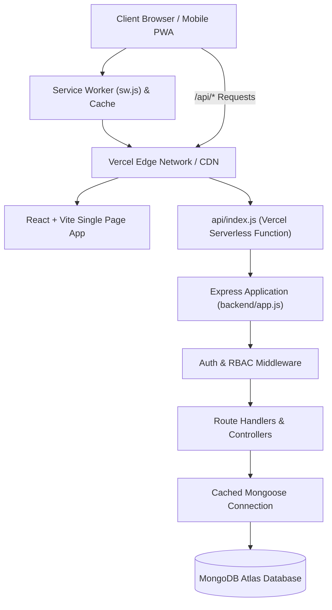

# System Architecture — CampusHub

## 1. High-Level Architecture

CampusHub is structured as a decoupled full-stack application tailored for seamless deployment on serverless infrastructure (Vercel) backed by MongoDB Atlas.



---

## 2. Frontend Architecture (React + Vite PWA)

- **Framework**: React 18+ with Vite for fast HMR and optimized production bundles.
- **Routing**: `react-router-dom` with client-side RBAC wrappers:
  - `RequireAuth`: Validates session existence and verifies user role against permitted roles.
  - `RoleRedirect`: Directs users straight to their tailored dashboard upon authentication.
- **State Management**:
  - `AuthContext`: Centralized user profile, active token management, and login/logout orchestration.
  - Modular API Services: Encapsulated Axios client with standard request/response interceptors.
- **Design Tokens**:
  - Implemented in `frontend/src/styles/tokens.css` and `global.css`.
  - Pure CSS variables without CSS-in-JS overhead; dark/light mode adaptable.
- **PWA Capabilities**:
  - `manifest.webmanifest`: App branding, standalone display, icons, and theme colors.
  - `sw.js`: Service worker implementing a network-first strategy with offline page fallback (`/offline.html`).
  - **Zero Private Caching**: Private API responses are strictly excluded from service worker disk caches.

---

## 3. Serverless Backend Architecture (Node.js + Express)

A primary architectural requirement is compatibility with **Vercel Serverless Functions**:

1. **No Long-Running Listeners**:
   - In production (`api/index.js`), the Express app is exported directly as a serverless request handler (`export default app`).
   - `app.listen()` is isolated strictly to local development via `backend/server.js`.
2. **Mongoose Serverless Connection Caching**:
   - Serverless invocations reuse warm container contexts. The database connection module (`backend/config/db.js`) maintains a global connection cache (`global.mongoose = { conn: null, promise: null }`) to prevent connection pool exhaustion across lambda executions.
3. **Layered Module Structure**:
   - `routes/`: Express routers specifying endpoint paths, validation middleware, and role access guards.
   - `controllers/`: Request handling, parameter extraction, and business logic execution.
   - `models/`: Mongoose schemas defining data types, relationships, and secondary indexes.
   - `middleware/`: Security headers (`helmet`), CORS filtering, rate limiting, authentication verification, and centralized error handling.
   - `services/`: Reusable cryptographic hashing (Argon2id), JWT issuance, and AI prompt assembly.

---

## 4. API Request/Response Convention

All backend endpoints adhere to a standardized JSON envelope:

### Success Response Format:
```json
{
  "success": true,
  "message": "Action completed successfully.",
  "data": { ... }
}
```

### Error Response Format:
```json
{
  "success": false,
  "message": "Human-readable explanation of why the action failed."
}
```
Sensitive stack traces are stripped in production and logged exclusively on the server runtime.
