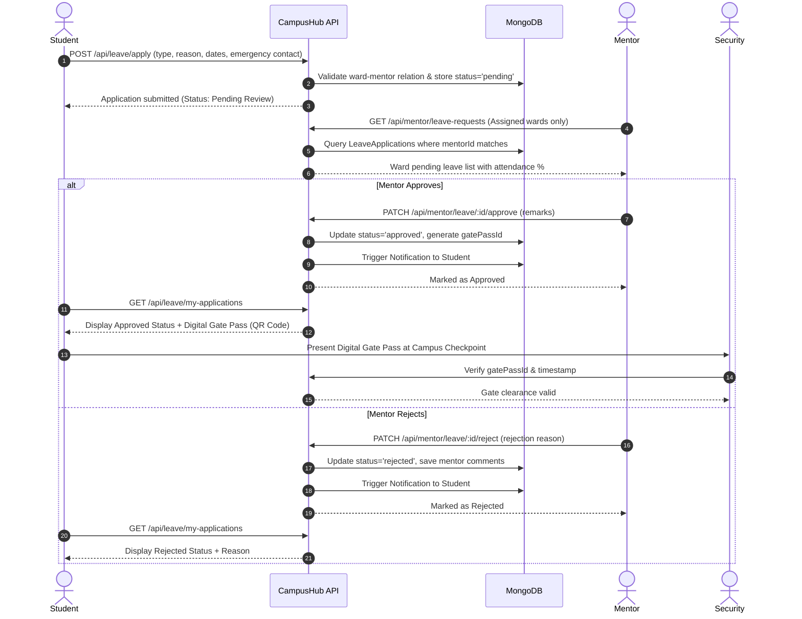
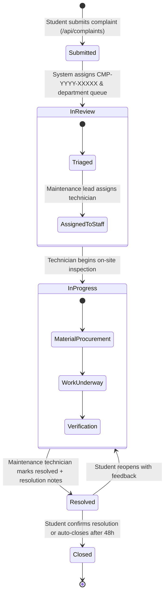
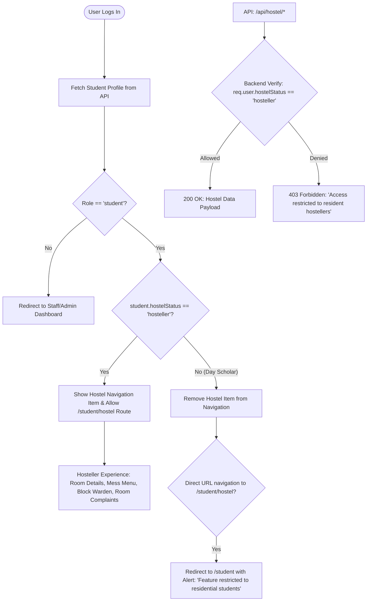
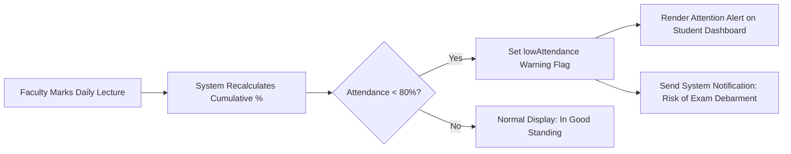

# End-to-End Workflows — CampusHub

This document outlines key operational processes within CampusHub, detailing branching logic, role interactions, and state progressions.

---

## 1. Student Leave & On-Duty (OD) Approval Workflow

The leave workflow enforces hierarchical verification: only the student's designated faculty mentor can review and authorize absences.

---

## 2. Complaint & Maintenance Resolution Lifecycle

Tickets are routed based on problem category (Hostel, Electrical, IT, Plumbing, Civil, Mess) to appropriate departments.

---

## 3. Hostel Status Access Gating Workflow

To prevent unauthorized access or visual clutter, hostel features are protected at both the frontend presentation layer and the backend API authorization layer.

---

## 4. Attendance Monitoring & Exam Eligibility Trigger

